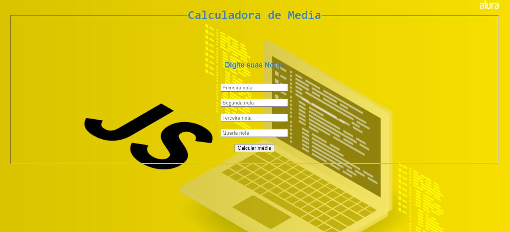

Desafio proposto pelos instrutores na Imersão Dev da Alura para fazer uma calculadora de media para calcular 4 notas de alunos(a) e mostrar uma mensagem se o aluno foi aprovado ou não.

Tecnologias usadas: HTML5, CSS3 e JavaScript

